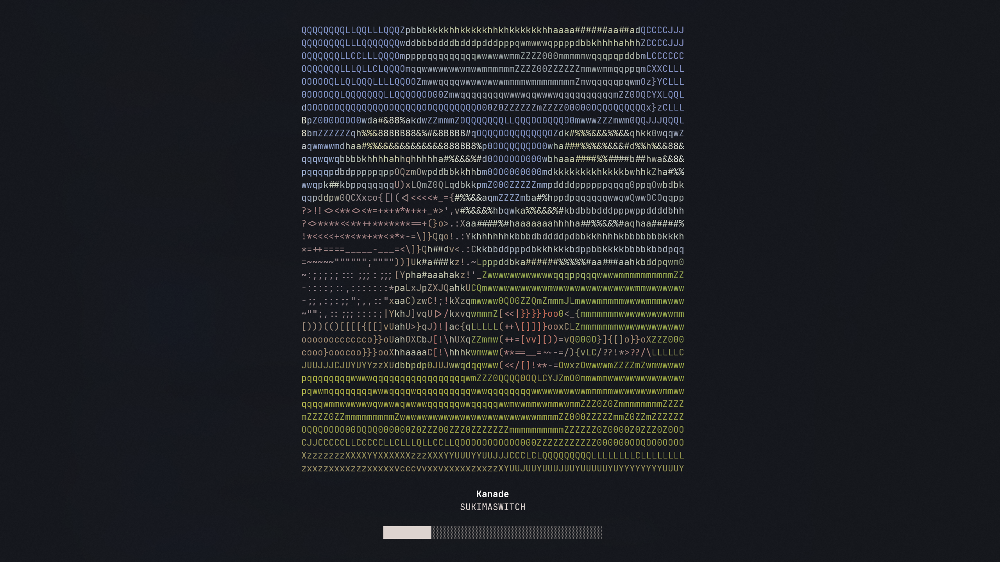
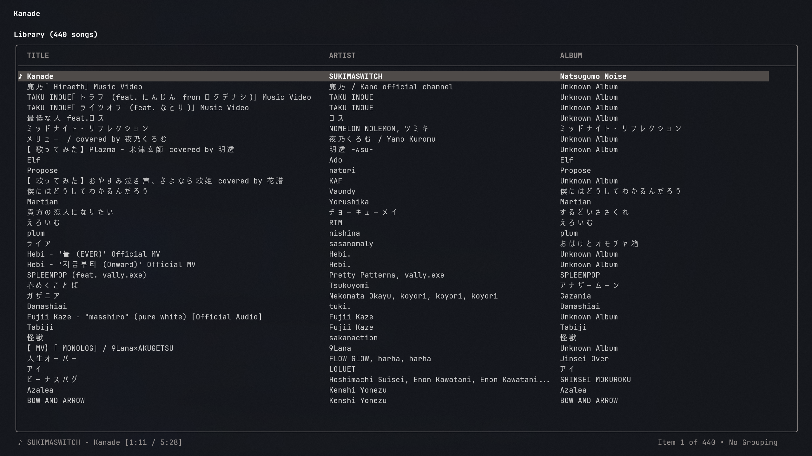

# Kanade

A minimal, terminal-based music player written in Go.

Kanade is a lightweight, terminal-first music player designed for simplicity and ease of use. Point it at a folder of audio files and play your music without leaving the terminal.

## Screenshots

### Player View



### Library View



## Features

- **Minimalist TUI:** A clean and intuitive terminal user interface.
- **Music Library:** Browse your collection flat or grouped by album/artist.
- **Audio Playback:** Play, pause, seek, shuffle, and repeat (off / all / one).
- **Search:** Instant filtering as you type.
- **Mouse Support:** Click songs to play, scroll lists, click the progress bar to seek.
- **Metadata Support:** Reads ID3/Vorbis tags to display song information.
- **Album Art:** Renders album art directly in the terminal with an adaptive accent color.
- **Media Keys:** System play/pause/next/previous keys work on Windows, macOS, and Linux (MPRIS).

## Supported Formats

`.mp3` `.wav` `.flac` `.ogg`

## Keybindings

Press `?` at any time for the full reference.

| Key | Action |
| --- | --- |
| `q` / `ctrl+c` | Quit |
| `?` | Help overlay |
| `tab` | Switch player / last view |
| `p` or `space` | Play / pause |
| `+` / `-` | Volume up / down |
| `m` | Mute |
| `r` | Repeat mode: off → all → one |
| `z` | Shuffle on/off |
| `/` | Search (library) |
| `:` | Command mode |
| `enter` | Play song / expand group |
| `g` | Cycle grouping: none → album → artist |
| `c` | Jump to current song |
| `R` | Rescan library folder |
| `←` / `→` | Seek ±10s (player) |
| `shift+←` / `shift+→` | Previous / next track |

### Commands

`:play` `:pause` `:stop` `:next` `:prev` `:vol <0-100>` `:mute` `:shuffle [on\|off]` `:repeat [off\|all\|one]` `:search <query>` `:vl` `:vp` `:reload` `:q`

## Installation

### 1. Download from Releases

Pre-built binaries for Windows, Linux, and macOS are available on the [Releases](https://github.com/PXR05/kanade/releases) page.

1. Go to the [Releases](https://github.com/PXR05/kanade/releases) section.
2. Download the appropriate binary for your operating system.
3. Run it, passing your music folder (or run inside it):

```bash
kanade ~/Music
```

> [!TIP]
> Run `kanade --help` for usage instructions.

### 2. Using Go

If you have Go installed, you can run or install Kanade directly:

```bash
git clone https://github.com/PXR05/kanade.git
cd kanade

# run the application directly
go run . ~/Music

# or install the application globally
go install .
kanade ~/Music
```

### 3. Manual Build

```bash
git clone https://github.com/PXR05/kanade.git
cd kanade
go build
./kanade ~/Music
```

> [!NOTE]
> Building for Linux requires ALSA development headers (`libasound2-dev`) since playback uses cgo there.

## Dependencies

Kanade is built with these Go libraries:

- [Bubble Tea](https://github.com/charmbracelet/bubbletea) for the TUI.
- [Lipgloss](https://github.com/charmbracelet/lipgloss) for styling.
- [Beep](https://github.com/gopxl/beep) for audio playback.
- [tag](https://github.com/dhowden/tag) for reading metadata.
