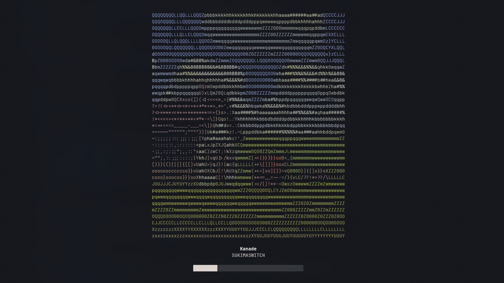

# Kanade

A simple, terminal-based music player written in Go.

Kanade is a lightweight, terminal-first music player designed for simplicity and ease of use. It allows you to manage your local music library, download new songs, and play your music without leaving the terminal.

## Screenshots

### Library View


> [!TIP]  
> `/` to search.
> `c` to jump to current song.
> `g` to switch grouping mode.
> `tab` to switch between library and player.

### Player View



> [!TIP]  
> `space` to play/pause.
> `left` and `right` to seek.
> `shift + left` and `shift + right` to skip.
> `up` and `down` to adjust volume.
> `tab` to switch between player and previous view.

## Features

- **Minimalist TUI:** A clean and intuitive terminal user interface.
- **Music Library:** Browse and manage your music collection.
- **Downloader:** Download audio from YouTube videos directly into your library.
- **Audio Playback:** Play, pause, and seek through your tracks.
- **Metadata Support:** Reads ID3v2 tags to display song information.
- **Album Art:** Displays album art directly in the terminal (if available).

> [!IMPORTANT]
> Kanade requires [ffmpeg](https://ffmpeg.org) installed on your system for video to audio conversion when downloading from YouTube.

## Dependencies

Kanade is built with these Go libraries:

- [Bubble Tea](https://github.com/charmbracelet/bubbletea) for the TUI.
- [Lipgloss](https://github.com/charmbracelet/lipgloss) for styling.
- [Beep](https://github.com/gopxl/beep) for audio playback.
- [youtube/v2](https://github.com/kkdai/youtube) for downloading audio.
- [id3v2](https://github.com/bogem/id3v2) and [tag](https://github.com/dhowden/tag) for metadata handling.

## Installation

### 1. Download from Releases

Pre-built binaries for Windows, Linux, and macOS are available on the [Releases](https://github.com/PXR05/kanade/releases) page.

1. Go to the [Releases](https://github.com/PXR05/kanade/releases) section.
2. Download the appropriate binary for your operating system.
3. Run the executable.

> [!TIP]
> Run `./kanade --help` for usage instructions.

### 2. Using Go

If you have Go installed, you can run Kanade directly without building a binary:

```bash
go run .
```

### 3. Manual Build

If you prefer to build from source:

```bash
# Clone the repository
git clone https://github.com/PXR05/kanade.git
cd kanade

# Build the application
go build

# Run the executable
./kanade
```
